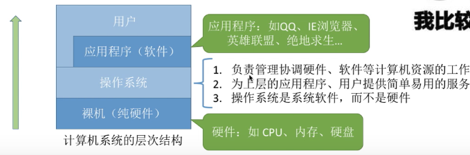

# 操作系统基础概念

## 概念

::: note 

一定要清楚操作系统是一种**系统软件**。学习操作系统的时候可以结合自己平时日常使用操作系统的经验来理解、记忆和应用，真正做到学以致用。

:::

概念图:

操作系统主要是有以下三个方面的定义：

1. 负责管理和协调硬件、软件等计算机资源的工作（控制和管理整个计算机系统的硬件和软件资源，对计算机的工作进行调度和资源的分配）
2. 是一种能够为上层用户、应用程序提供简单易用的服务（给用户和其他软件提供方便的接口和环境）
3. 是一种**系统软件**

## 功能和目标

1. 服务用户——操作系统作为用户提供接口和公共服务程序
2. 进程交互——操作系统作为进程执行的控制者和协调者
3. 系统实现——操作系统作为扩展器或者虚拟机
4. 资源管理——操作系统作为资源的管理者和控制者

## 操作系统四大特征

### 并发

并发概念：指两个或者多个事件在同一时间间隔内发生，宏观上是同时发生，微观上是交替切换发生。

并行概念：指两个或者多个事件在同一时间时刻发生。

### 共享

::: tip

失去并发性，系统中只有一个程序在运行，不能跟其他程序共享，故共享性失效。

失去共享性，不同程序之间不能同时访问资源，不能同时执行不同的程序，这样程序失去了并发性。

:::

共享概念：共享意思为资源共享，操作系统中的资源被多个并发执行的程序共同使用。

资源共享的方式：主要分为两种，**互斥共享**和**同时访问**。

1. 互斥：一个时间段内只允许一个进程访问该资源。
2. 同时访问：一个时间段内允许多个进程同时对资源进行访问。

### 虚拟

::: tip

没有并发性就谈不上虚拟性

:::

虚拟概念：把一个物理上的实体变成若干个逻辑上对应的物体。物理实体是实际存在的，而逻辑上的物体是用户感受到的。

### 异步

::: tip

失去并发性，系统只能串行执行程序，当程序执行完毕后才会归还，只有系统具有并发性，才能有异步性。

:::

异步概念：异步是指在多道程序环境下，允许多个程序并发执行，但资源有限，进程的执行是走走停停的，不连贯的，以不可预知的速度向前推进。

## 三种基本操作系统及特征

1. 批处理操作系统

   批量集中处理多道程序，多道程序运行，作业脱机工作

2. 分时操作系统

   具有同时性、独立性、及时性、交互性

3. 实时操作系统

   提供即时响应和高可靠性

