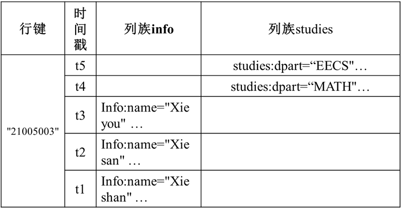
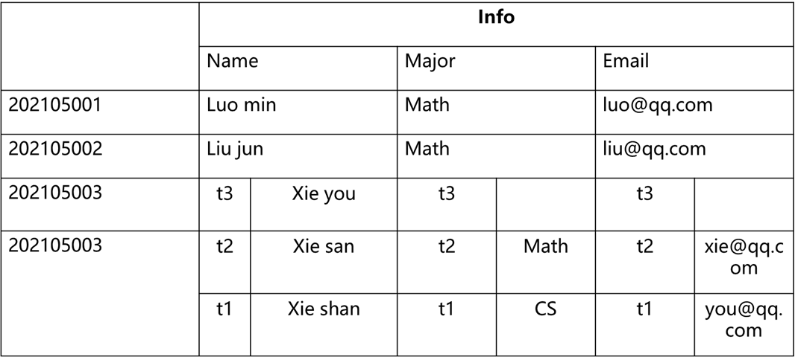
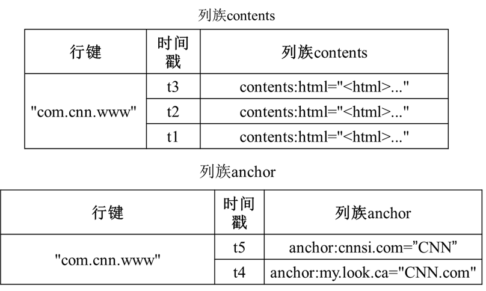
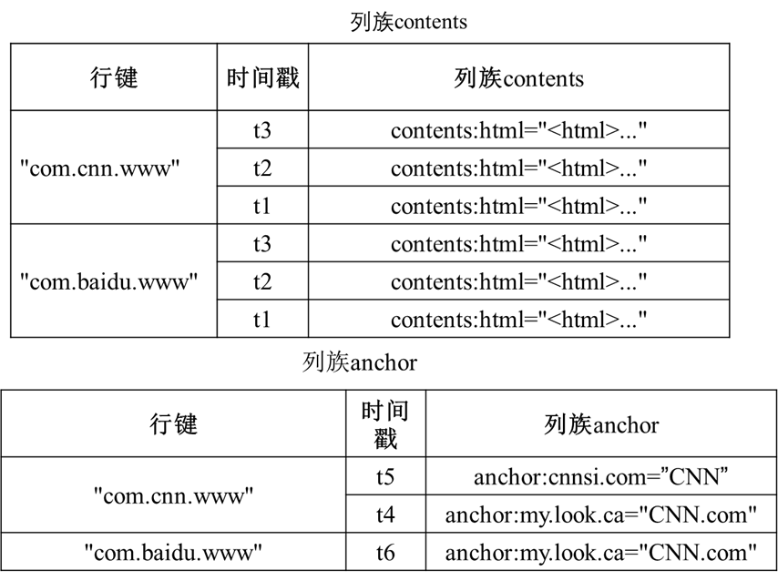
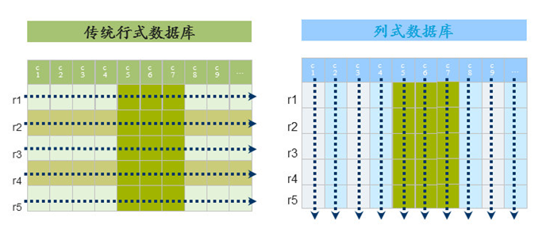
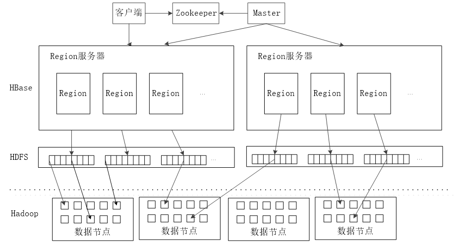
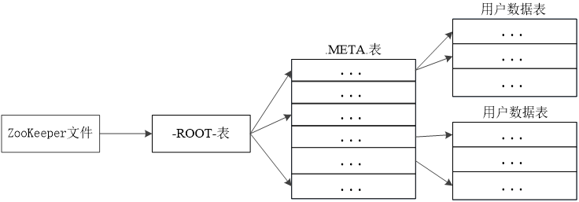
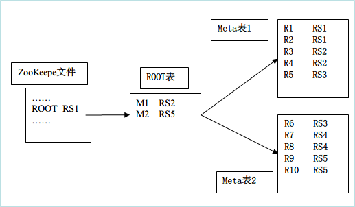
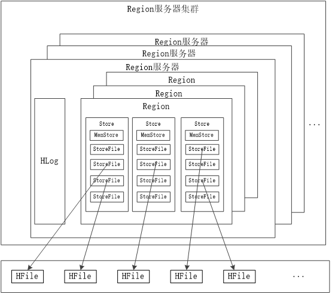

# HBase 技术原理

## HBase 数据模型

HBase 是典型列存储型数据库，主要存储的方式是以列为单位进行。

### 表结构

一张 HBase 的表主要由以下结构组成：

- 行键：一行数据的唯一标识。比如 ID 等
- 列族：一个列族包含多个列，你可以理解是用来对不同的列进行分类的名称，一般是用来描述属于同一类事物的列，是对多个列的特征提取（抽象）。比如学生信息、成绩等
- 列：列族的基本单位，包含具体的信息。比如学号、姓名等
- 时间戳：因为 HDFS 的特性，不能对数据进行修改操作，所有的数据都会通过时间戳来**管理数据的版本**，一切数据的修改都会对应到一个时间戳，不会把数据删除。
- 单元格：包含对应的属性，要确定一个单元格的值需要通过一个四维坐标来确定：$[行键,列族,列,时间戳]$。通过这样的坐标就可以确定一个单元格的值。如$[1,学生信息,姓名,1123112312321]$

### 概念视图

> 带时间戳且所有列写成一个格子的表

 概念视图其实你通过看到它的结构也可以理解到，其实就是**描述了一个行键内部的数据结构**，我们可以将上图转化一下就能够得到存储的结构了。只列出更新的数据。

针对于像网站地址这种，末尾字符串的值具有一定规律特征的，你可以把这些地址逆序之后再存储，因为逆序之后，就可以实现自动把地址进行归类，按照计算机网络当中所讲述的域名层级关系来分类了。第一级为根域名，第二季为二级域名，以此类推。这样做就能够让具有相同特征的数据存储在同一个 Region 里面，加快检索效率。

同时概念视图你可以理解为不同列族在相同时间戳内不一定都要存储所包含列族的数据，也就是下图当中的，$t_1,t_2,t_3$ studies 列族是没有数据的，但 $t_4,t_5$​ 的时候 info 列族没有数据。

- 概念视图

- 与数据模型合并

### 物理视图

> 拆开空格部分和列族的概念视图

物理视图你可以理解为：本质上描述的是数据在物理层面上的存储结构，当你在存储数据和数据表的时候，物理层面上是会将两个带有空缺的部分分离开来，结构如下

对比可以发现，物理存储结构上是不会出现空值的，因为出现空值会导致磁盘空间的浪费，所以在底层结构上，不同的列族会存储分离多个与原来结构相同的表来进行存储。

不同的行键会存储到同一个列族的表下，具体结构如下。

### 按列存储

按行存储：其实指的是元素是按照一行一行被存储的，在磁盘当中一行数据是被连续存储的。也就是说，当你想获取数据的时候，必须要连续扫描整行的数据之后才能读取出来。然后再从一行的所有数据当中选择所需要的列属性。

按列存储：按列是按照列来对属性进行存储，对于一个关系（列族）就可以被分解成多个子关系（列），然后对每个子关系单独存储。你可以看成一个列族就是一个关系，也就是原来里面的一个表，不同表是单独存储到不同的位置的，然后现在只不过是可以把多个表联系成一个表，**实际存储的时候会将同一行的不同属性值存储到不同的磁盘页当中。**（在磁盘当中的存储是随机而离散的，所有的表都通过行键联系起来）

- 优点：能够支持大量的 IO 操作，降低 IO 的开销，支持大量并发查询，数据处理速度快。
- 缺点：连接操作耗费时间。

## HBase 运行原理

HBase 主要由三部分组成：用户API、一个主服务器 Master、多个 Region 服务器。

- 用户API：用于用户调用接口操作 HBase
- Master：管理和维护 HBase 的分区信息，也就是数据表所在的 Region 服务器和 Region 的位置。
- Region 服务器：管理和维护 Region，也就是数据表所在具体的位置。

### 表的存储结构

一个数据表是被分成多个小块进行存储的，这里的块就是指 Region。结构如下图

Region 大小达到一定程度之后就会分裂，有点像**细胞分裂**一样，将数据不断地均匀分布到 HDFS 当中。

不同的 Region 就会被分配给不同的 Region 服务器来管理。

那么，你现在想查找对应存储的数据的话，就需要研究如何来定位 Region 的位置。

### Region 定位结构

那么，Region 是如何来定位的呢？

因为客户端不是直接通过访问 Master 来对数据表进行操作的，而是通过 Zookeeper 对数据表进行操作，交给 Zookeeper 程序来进行协调和调度。

定位主要分成三层结构：

- Zookeeper：负责记录 -ROOT- 表的位置
- -ROOT- 表：记录 .META. 表的信息，一个 -ROOT-表只能记录一个 Region的信息。通过 -ROOT- 表找 .META. 位置数据。
- .META. 表：记录 Region 的位置，.META. 表可以有多个 Region。 

要求画结构图的时候按照此格式来画。往前传递一级。**因为都是记录相互彼此的信息，所以Zookeeper 应该要记录 ROOT 表的信息，ROOT 表记录的是 META 表的信息，所以里面的内容应该是对应表的存储位置信息**

### Region 服务器工作原理

MenStore：Store 中的缓存

StoreFile：磁盘中的文件

- 读写数据过程

  写入数据的时候，会分配对应的 Region 服务器来执行，数据会先被写入到 MemStore 和 HLog当中。写入 HLog 调用 commit() 才会返回结果给客户端

  读取数据的时候，Region 服务器会访问 MemStore 缓存，找不到再去 StoreFile 找。 （类似操作系统的快表和磁盘）

- 缓存刷新

  系统周期性刷新 MemStore 里面的内容到 StoreFile，并在 HLog 标记。每次刷新都会创建一个新的 StoreFIle 文件。

  **每次启动都会检查 HLog，是否有写入操作，如果有则先写入 MemStore，再稍后再写到 StoreFile，并删除 HLog**。

- StoreFile 的合并

  当 StoreFile 数量太多的时候（达到阈值）会自动执行 Store.compact() 合并多个 StoreFile。

### Store 工作原理

> 模拟大自然的细胞生命周期，帮助存储文件

- StoreFile 数量太多会自动合并 StoreFile
- 单个 StoreFile 太大则又会自动分裂

### HLog 工作原理

每个 Region 服务器都会有一个 HLog。

HLog 存储的是用户**更新数据**的操作。其他读信息的操作不回更新 HLog。因为每次写入数据都会先写入 MemStore，但是在数据量大的情况下，MemStore 一下子装不下那么多数据，所以通过 HLog 记录对应需要的操作，等待 MemStore  写入到磁盘 StoreFile 之后再继续执行 HLog 后续的操作。**（先写入 MemStore，随后再依次写入 StoreFile）**

当 Region 服务器故障的时候，Zookeeper通知 Master 服务器执行数据恢复操作。

首先会先查找故障服务器的 HLog 每条日志记录都记录了对应数据所属的 Region 对象，然后对数据进行拆分，分配到对应的 Region 对象的目录下，然后重新分配数据和 HLog 到可用的 Region 服务器，然后 redo 日志记录的操作，写入 MemStore 和 StoreFile，恢复数据。

流程：Zookeeper 通知 Master 服务器 → Master 读取遗留的 HLog → 选出对应时间段之内的更新操作的记录以及操作的对象（缓存刷新后会删除 HLog，所以要根据看哪个时间段是没有被刷新的） → 将 HLog 进行拆分成两份，根据之前的操作进行分类拆分，分别放到对应的可用 Region 服务器的 Region 对象，写入 HLog 到缓存和执行 HLog 的操作。 