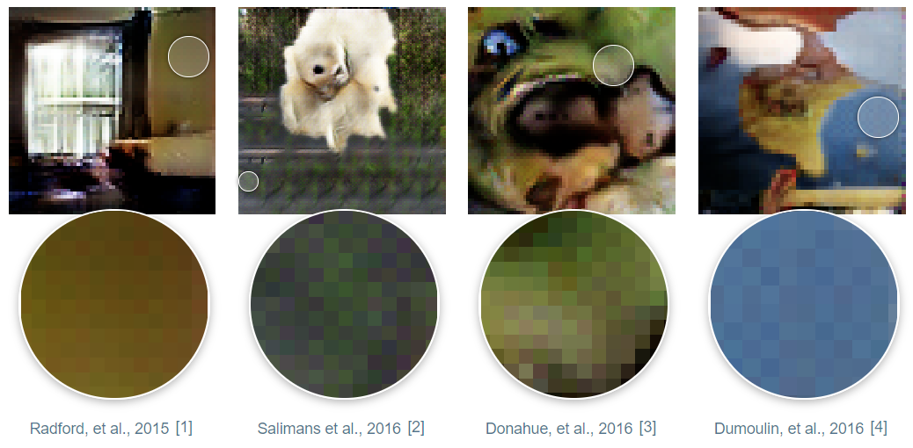
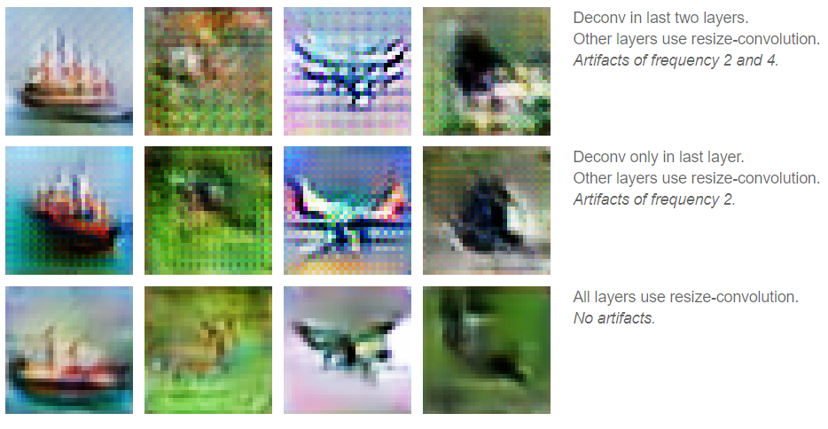
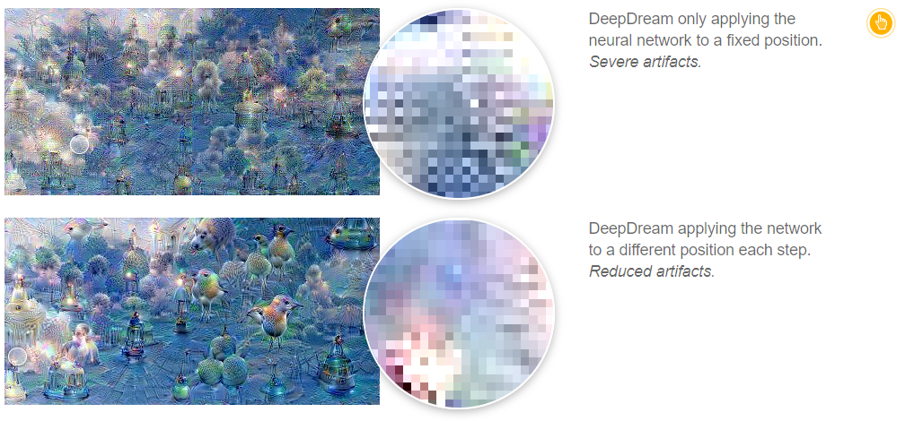

# Deconvolution and Checkerboard Artifacts

Augustus Odena，[Vincent Dumoulin](http://vdumoulin.github.io/)，[Chris Olah](http://colah.github.io/)

## 抛出问题

我们可以看到上面这几张图片，仔细看能够明显看到有一些奇怪的类似棋盘格子的图案，这是一个在使用Convolution的时候经常会遇到的问题。我们可以称为棋盘效应(checkerboard pattern of artifacts)。一般来说，棋盘效应会在颜色比较明显、鲜艳，丰富的图片上最为明显，到底发生了什么才导致这样的结果？是神经网络更喜欢明亮一点的颜色？产生这些伪影的原因实际上非常简单，下面将讲解其原理和解决方法。

## Deconvolution和Overlap

当我们用神经网络生成一些图片的时候，我们通常是用多通道低分辨率的Feature Map生成图片。这样能够使得神经网络可以先输出粗糙的图像，然后填充细节。为了实现这种操作，我们需要一种方式能够使得从低分辨率图像变成高分辨率图像。我们通常就会使用反卷积操作(Deconvolution)。通俗来讲，反卷积层主要作用是将低分辨率图像中的每一个像素映射成由多个像素组成的更大的方形。

> 反卷积有多种解释和不同的名称，包括“转置卷积”。为了简洁起见，我们在本文中使用名称“反卷积”。有关反卷积的纹线，请参见 [[5](https://arxiv.org/pdf/1603.07285.pdf), [6](https://arxiv.org/pdf/1609.07009.pdf)]。

不幸的是，反卷积很容易产生“不均匀重叠”，在某些地方比其他地方放置更多的隐喻[[7](http://www.foldl.me/uploads/papers/tr-cgans.pdf)]。 特别是，当kernel大小（输出窗口大小）不能被stride步长（顶部点之间的间距）整除时，反卷积具有不均匀的重叠。 虽然原则上网络可以仔细学习权重来避免这种情况 ，我们将在后面更详细地讨论 。但在实践中，神经网络很难完全避免这种情况。

重叠图案也以二维形式形成。两个轴上的不均匀重叠相乘在一起，形成了不同大小的典型棋盘状图案。

事实上，不均匀的重叠在两个维度上往往会更加极端！ 因为这两个图案相乘，所以不均匀度会平方。 例如，在一维中，步幅为 2，大小为 3 的反卷积的某些输出的输入数量是其他的两倍，但在二维中，这变成了四倍。

现在，神经网络通常在生成图像时使用多层反卷积，从一系列较低分辨率的描述中迭代构建更大的图像。 虽然这些堆叠的反卷积可以消除伪影，但它们通常会组合在一起，在各种尺度上产生伪影。

**步长为1的反卷积**—我们经常将其视为成功模型中的最后一层（例如 [[2](https://arxiv.org/pdf/1606.03498.pdf)]）  在抑制伪影方面非常有效。 他们可以去除划分其大小的频率伪影，并减少频率小于其大小的其他伪影。 然而，正如在许多最近的模型中看到的那样，伪影仍然可以泄漏。

除了我们在上面观察到的类似棋盘格的高频伪影之外，早期的反卷积会产生低频伪影，我们将在后面更详细地探讨这些伪影。

当输出不寻常的颜色时，这些伪影往往最为突出。 由于神经网络层通常具有偏差（添加到输出中的学习值），因此很容易输出平均颜色。 颜色 — 像鲜红色 — 离平均颜色越远，反卷积需要做出的贡献就越大。

## Overlap和Learning

从不均匀重叠的角度考虑事情是 —— 虽然一个有用的框架——有点简单化。 无论好坏，我们的模型都会为它们的反卷积学习权重。

理论上，我们的模型可以学习不均匀重叠的位置，从而使输出均匀平衡。

这是一种难以实现的平衡行为，尤其是当有多个渠道交互时。 避免伪影会显着限制可能的过滤器，从而牺牲模型大小。 在实践中，神经网络应该要学习完全避免这些模式。

事实上，不仅不均匀重叠的模型没有学会避免这种情况，甚至重叠的模型经常学习导致类似伪影的内核！ 虽然它们的默认行为不像不均匀重叠那样，但即使重叠反卷积也很容易导致伪影。

完全避免伪影仍然是对过滤器的一个重要限制，实际上这些模型中仍然存在伪影，尽管它们看起来更温和。 （参见 [[4](https://arxiv.org/pdf/1606.00704.pdf)]，它使用 stride 2 size 4 deconvolutions 作为示例。）

这里可能有很多因素在起作用。 例如，在生成对抗网络 (GAN) 的情况下，一个问题可能是鉴别器及其梯度（我们将在后面详细讨论）。 但问题的很大一部分似乎是反卷积。 最好的情况是，反卷积是脆弱的，因为它很容易表示生成棋盘效应的函数，即使大小是经过仔细选择的。 在最坏的情况下，棋盘效应是反卷积的默认行为。

是否有不同的上采样方法更能抵抗伪影？

## Better Upsampling

为了避免这些伪影，我们想要一种替代常规反卷积（“转置卷积”）的方法。 与反卷积不同，这种上采样方法不应将伪影作为其默认行为。 理想情况下，它会走得更远，并且偏向于此类工件。

一种方法是确保使用除以步幅的内核大小，避免重叠问题。 这相当于“子像素卷积”，这是一种最近在图像超分辨率方面取得成功的技术 [[8](https://arxiv.org/pdf/1609.05158.pdf)]。 然而，虽然这种方法有帮助，但反卷积仍然很容易生成伪影。

另一种方法是将上采样到更高分辨率从卷积中分离出来以计算特征。 例如，可以调整图像大小（使用[最近邻插值](https://en.wikipedia.org/wiki/Nearest-neighbor_interpolation)或[双线性插值](https://en.wikipedia.org/wiki/Bilinear_interpolation)），然后使用卷积层。 这似乎是一种自然的方法，大致相似的方法在图像超分辨率方面效果很好（例如 [[9](https://arxiv.org/pdf/1501.00092.pdf)]）。

反卷积和不同的 resize-convolution 方法都是线性运算，可以解释为矩阵。 这是查看它们之间差异的方法。 反卷积对每个输出窗口都有一个唯一的输入，resize-convolution 以一种降低高频伪影的方式隐式地进行权重绑定。

我们使用最近邻插值获得了最好的结果，但很难使双线性插值起作用。 这可能只是意味着，对于我们的模型，最近邻恰好与为反卷积优化的超参数配合得很好。 它还可能指出简单地使用双线性插值的问题，它对高频图像特征的抵抗力过强。 我们不一定认为这两种方法都是上采样的最终解决方案，但它们确实修复了棋盘效应。

## Implement

调整大小卷积层可以使用` tf.image.resize_images() `在 TensorFlow 中轻松实现。 为获得最佳结果，请在使用 `tf.nn.conv2d()` 进行卷积之前使用 `tf.pad()`以避免边界伪影。

## Image Generation Results

我们的经验是，在各种上下文中，最近邻调整大小后进行卷积效果非常好。

我们发现这种方法有帮助的一个例子是生成对抗网络。 简单地将标准反卷积层切换为最近邻调整大小，然后进行卷积会导致不同频率的伪影消失。

事实上，在任何训练发生之前就可以看到棋盘效应的差异。 如果我们查看生成器生成的图像，使用随机权重进行初始化，我们已经可以看到伪影：

这表明伪影是由于这种生成图像的方法所导致，而不是因为对抗性训练引入伪影。 （这也表明我们可能能够在没有训练模型缓慢反馈周期的情况下学到很多关于良好生成器设计的知识。）

相信这些伪影不是 GAN 特有的另一个原因是我们在其他模型中也看到它们，并且发现当我们切换到resize-convolution进行上采样时它们也会消失。 例如，考虑实时艺术风格迁移 [[10](https://arxiv.org/pdf/1603.08155.pdf)]，其中训练神经网络以直接生成风格迁移图像。 我们发现这些很容易受到棋盘效应的影响（尤其是当损失函数没有明确抵抗它们时）。 然而，将反卷积层换成resize-convolution层时就让棋盘效应消失了。

Google Brain 团队即将发表的论文将在更彻底的实验和最先进的结果中展示这种技术的好处。 （我们选择单独介绍这项技术，因为我们觉得它值得更详细的讨论，而且因为它跨越了多篇论文。）

## Artifacts in Gradients

每当我们计算卷积层的梯度时，我们都会对反向传播进行反卷积（转置卷积）。 这可能会导致渐变中出现棋盘格图案，就像我们使用反卷积生成图像时一样。

图像模型梯度中高频“噪声”的存在在特征可视化社区中是众所周知的，这是一个重大挑战。 不知何故，特征可视化方法必须补偿这种噪音。

例如，DeepDream [[11](https://research.googleblog.com/2015/06/inceptionism-going-deeper-into-neural.html)] 似乎以多种方式在棋盘效应之间造成破坏性干扰，例如同时优化许多特征，以及在许多偏移和尺度上进行优化。 特别是，在不同偏移量下优化的“抖动”抵消了一些棋盘伪影。

> 虽然一些伪影是我们的标准棋盘格模式，但其他人的是组织较少的高频模式。我们认为这些是由最大池化引起的。最大池化以前与 [[12](https://arxiv.org/pdf/1511.06394.pdf)] 中的高频伪影相关联。

最近在特征可视化方面的工作（例如 [[13](https://github.com/tensorflow/tensorflow/blob/master/tensorflow/examples/tutorials/deepdream/deepdream.ipynb)）准确识别并补偿了这些高频梯度分量。 所以这里就提出了一个问题：更好的神经网络架构是否可以不需要使用这些技巧避免伪影的产生。

这些梯度伪影会影响 GAN 吗？ 如果梯度伪影可以影响基于特征可视化中的神经网络梯度优化的图像，我们也可能期望它影响由生成器参数化的图像系列，因为它们被 GAN 中的鉴别器优化。

我们发现在某些情况下确实会发生这种情况。 当生成器既不变成棋盘效应也不对抗棋盘效应时，鉴别器中的跨步卷积会导致它们。

目前尚不清楚这些梯度伪影的更广泛影响是什么。 考虑它们的一种方法是，一些神经元会用邻近的梯度多此计算，被计算的梯度是任意选取的。 同样，网络会更关心输入中的某些像素。 这两个听起来都不理想。

似乎有一些像素比其他像素对网络输出的影响更大可能会夸大对抗性反例。 由于导数集中在少量像素上，这些像素的微小扰动可能会产生巨大的影响。 我们没有对此进行调查。

## Conclusion

使用反卷积生成图像的标准方法 — 尽管它取得了成功！ 存在一些概念上简单的问题，这些问题会导致生成的图像出现伪影。 使用没有这些问题的自然替代方法会导致伪影消失（类似的论点表明标准跨步卷积层也可能存在问题）。

这对我们来说似乎是一个令人兴奋的机会！ 它表明，仔细思考神经网络架构，即使在我们似乎有明确的工作解决方案的情况下，也可以找到容易实现的成果。

与此同时，我们提供了一个易于使用的解决方案，可以提高许多使用神经网络生成图像的方法的质量。 我们期待看到人们用它做什么，以及它是否在音频等领域有所帮助，在这些领域，高频伪影尤其成问题。

## Reference

1. **Unsupervised representation learning with deep convolutional generative adversarial networks** [[PDF]](https://arxiv.org/pdf/1511.06434.pdf)
   Radford, A., Metz, L. and Chintala, S., 2015. arXiv preprint arXiv:1511.06434.
2. **Improved techniques for training gans** [[PDF]](https://arxiv.org/pdf/1606.03498.pdf)
   Salimans, T., Goodfellow, I., Zaremba, W., Cheung, V., Radford, A. and Chen, X., 2016. Advances in Neural Information Processing Systems, pp. 2226—2234.
3. **Adversarial Feature Learning** [[PDF]](https://arxiv.org/pdf/1605.09782.pdf)
   Donahue, J., Krahenbuhl, P. and Darrell, T., 2016. arXiv preprint arXiv:1605.09782.
4. **Adversarially Learned Inference** [[PDF]](https://arxiv.org/pdf/1606.00704.pdf)
   Dumoulin, V., Belghazi, I., Poole, B., Lamb, A., Arjovsky, M., Mastropietro, O. and Courville, A., 2016. arXiv preprint arXiv:1606.00704.
5. **A guide to convolution arithmetic for deep learning** [[PDF]](https://arxiv.org/pdf/1603.07285.pdf)
   Dumoulin, V. and Visin, F., 2016. arXiv preprint arXiv:1603.07285.
6. **Is the deconvolution layer the same as a convolutional layer?** [[PDF]](https://arxiv.org/pdf/1609.07009.pdf)
   Shi, W., Caballero, J., Theis, L., Huszar, F., Aitken, A., Ledig, C. and Wang, Z., 2016. arXiv preprint arXiv:1609.07009.
7. **Conditional generative adversarial nets for convolutional face generation** [[PDF]](http://www.foldl.me/uploads/papers/tr-cgans.pdf)
   Gauthier, J., 2014. Class Project for Stanford CS231N: Convolutional Neural Networks for Visual Recognition, Winter semester, Vol 2014.
8. **Real-time single image and video super-resolution using an efficient sub-pixel convolutional neural network** [[PDF]](https://arxiv.org/pdf/1609.05158.pdf)
   Shi, W., Caballero, J., Huszar, F., Totz, J., Aitken, A.P., Bishop, R., Rueckert, D. and Wang, Z., 2016. Proceedings of the IEEE Conference on Computer Vision and Pattern Recognition, pp. 1874—1883. [DOI: 10.1109/cvpr.2016.207](https://doi.org/10.1109/cvpr.2016.207)
9. **Image super-resolution using deep convolutional networks** [[PDF]](https://arxiv.org/pdf/1501.00092.pdf)
   Dong, C., Loy, C.C., He, K. and Tang, X., 2014. arXiv preprint arXiv:1501.00092.
10. **Perceptual losses for real-time style transfer and super-resolution** [[PDF]](https://arxiv.org/pdf/1603.08155.pdf)
    Johnson, J., Alahi, A. and Fei-Fei, L., 2016. arXiv preprint arXiv:1603.08155.
11. **Inceptionism: Going deeper into neural networks** [[HTML]](https://research.googleblog.com/2015/06/inceptionism-going-deeper-into-neural.html)
    Mordvintsev, A., Olah, C. and Tyka, M., 2015. Google Research Blog. Retrieved June, Vol 20.
12. **Geodesics of learned representations** [[PDF]](https://arxiv.org/pdf/1511.06394.pdf)
    Henaff, O.J. and Simoncelli, E.P., 2015. arXiv preprint arXiv:1511.06394.
13. **DeepDreaming with TensorFlow** [[link]](https://github.com/tensorflow/tensorflow/blob/master/tensorflow/examples/tutorials/deepdream/deepdream.ipynb)
    Mordvintsev, A., 2016.